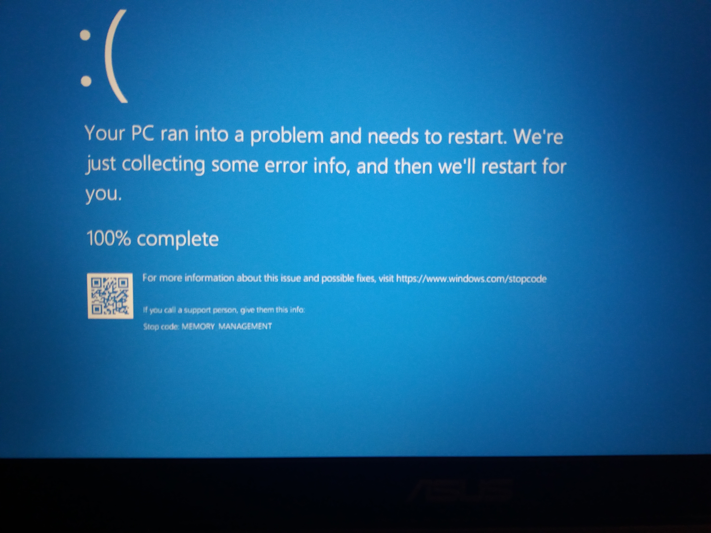
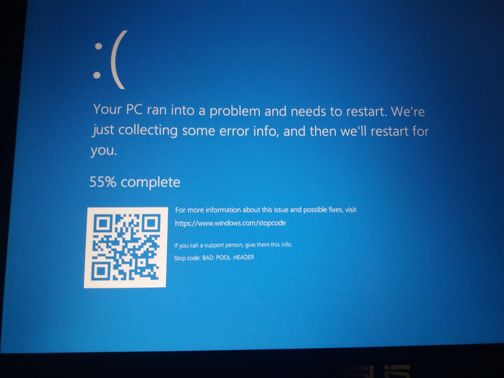
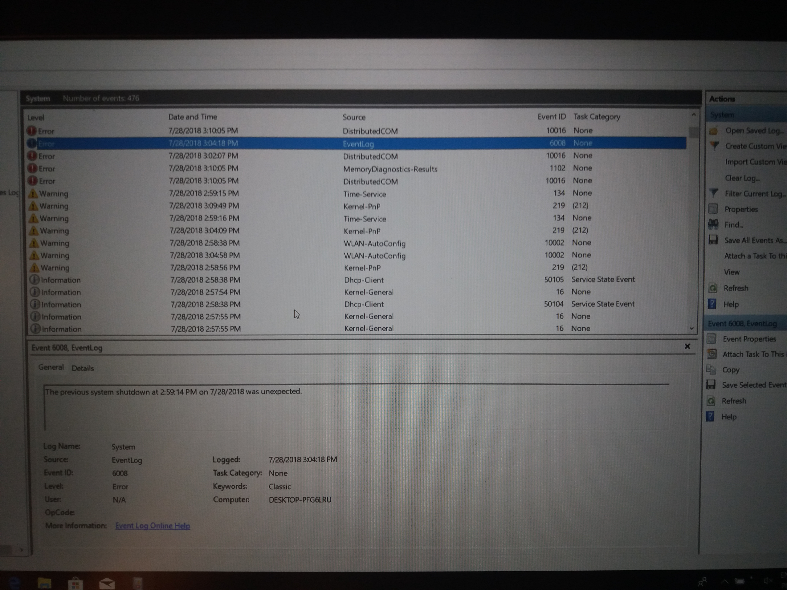
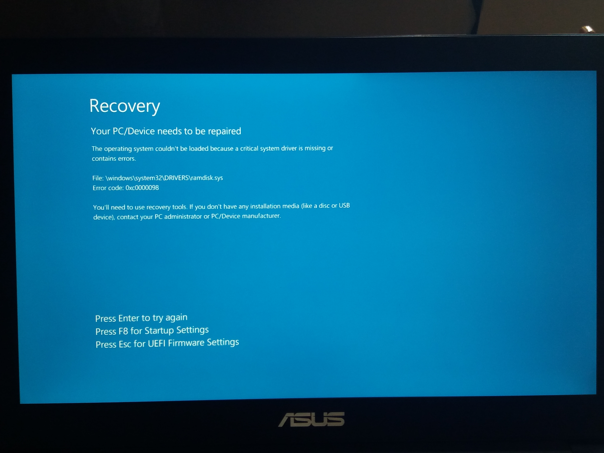
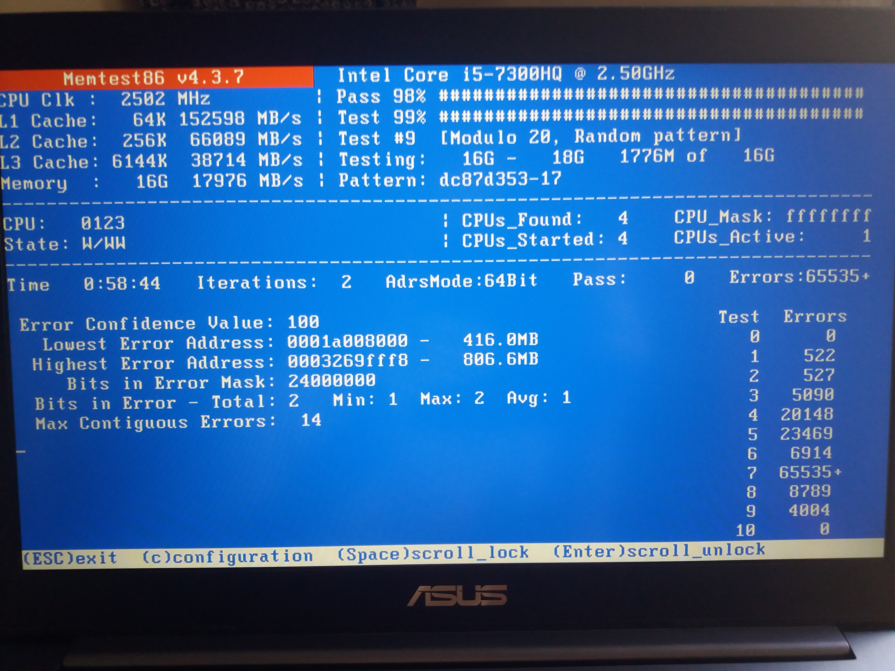
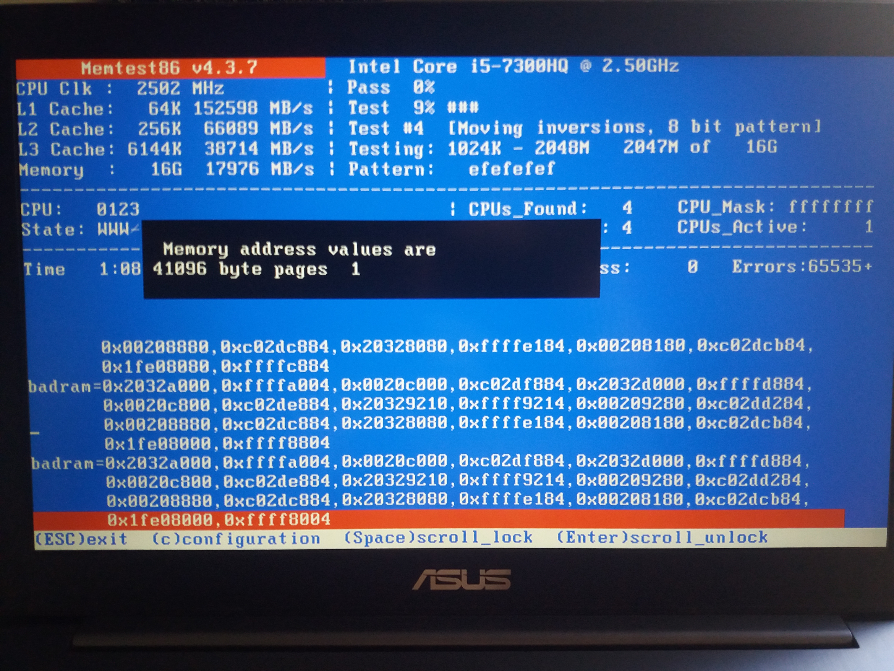

# Spis treści
1. Opis problemu
2. Podjęte kroki diagnostyczne
3. Wnioski

---

# 1. Opis problemu

Po 2 miesiącach bezproblemowego użytkowania zaczęły się pojawiać problemy ze stabilnością działania systemów operacyjnych.

* Windows 10 64-bit: ekrany BSoD (najczęściej  Stop Code: MEMORY_MANAGEMENT).
* Ubuntu 18.04 64-bit: problemy przy wybudzaniu z trybu uśpienia (całkowita utrata interakcji z systemem), zawieszanie sie w losowych momentach (co nigdy się nie zdarzało)

---

## 2. Podjęte kroki diagnostyczne

### 2.1 Windows 10

Zaczałem od wielokrotnego przeprowadzenia testów przy użyciu narzędzia **Windows Memory Diagnostics Tool**, którego wynik w _Dzienniku Zdarzeń_ zawsze sugerował problem o charakterze sprzętowym.

Inne rekordy o błędach:

Podjąłem **pomyślną** próbę przeinstalowania Windowsa za pomocą _Resetuj ustawienia komputera do stanu początkowego_.
**Niestety nie byłem w stanie zainstalować poprawnie wszystkich sterowników pobranych ze strony ASUSa ze względu na nieoczekiwane restarty** (oczywiście kiedy z komputerem było wszystko w porządku, wszystkie sterowniki były poprawnie zainstalowane)

Nastepnie podjąłem **nieudaną** próbę reinstalacji z bootowalnego USB:
                     

---

### 2.2 Ubuntu
(http://manpages.ubuntu.com/manpages/trusty/man8/memtester.8.html)

Nieudane były również kilkukrotne próby przeprowadzenia testów na systemie Ubuntu 18.04 64-bit.
W trakcie działania programu **memtester** cały komputer trwale przestawał reagować w losowych momentach mimo, iż test powtórzony na innej, dużo słabszej jednostce sprzętowej działał bez zarzutu.

---

### 2.3 Memtest86
(https://www.memtest86.com, https://www.memtest86.com/technical.htm)

Po zapoznaniu sie z dokumentacją, wypaleniu ISO na pendrive i uruchomieniu go otrzymałem następujące wyniki:

## 3. Wnioski

Z mojej strony:

Prawdopodobną przyczyną jest uszkodzenie pamięci - wykazały to testy.
**Niestety nie mam świadomości (ani poszlak) wkazujących na inne przyczyny, lecz nie wykluczam ich istnienia**.
